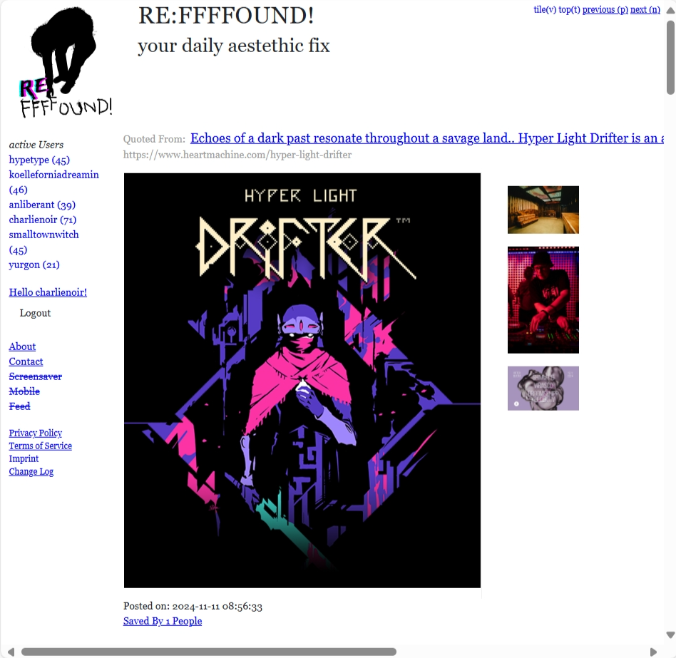
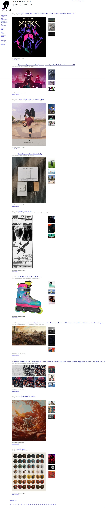
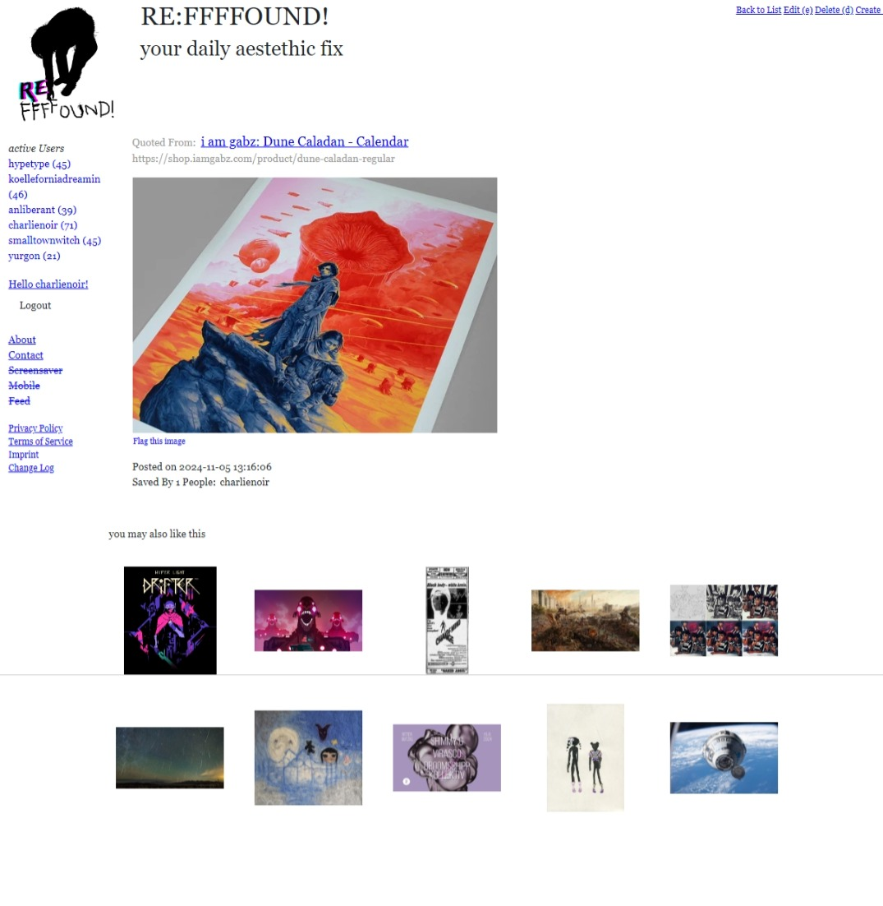
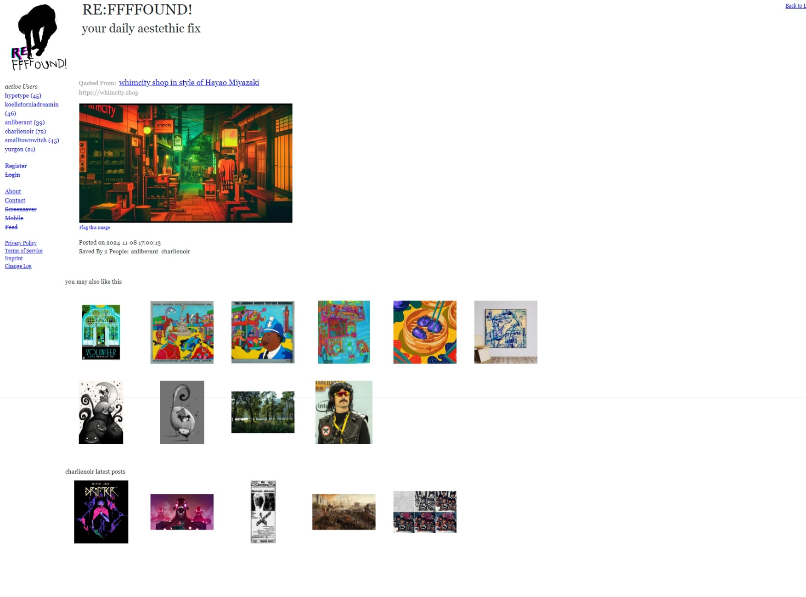
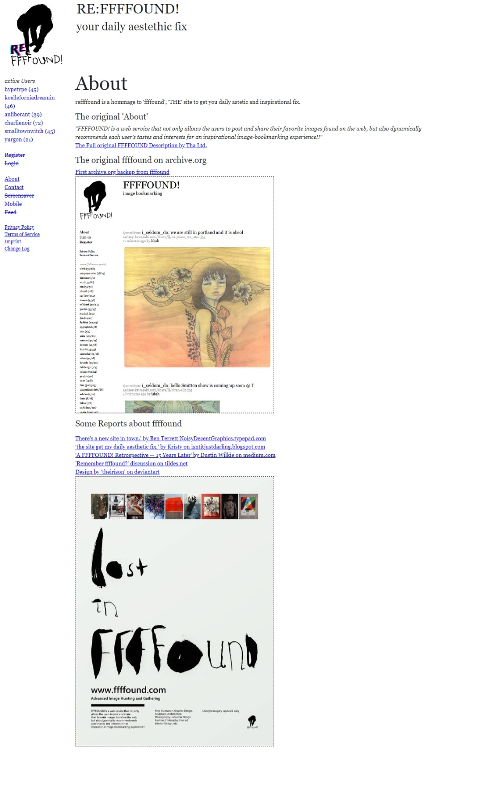

# About - re: ffffound

Dies ist das Repository für die Webandwendung 're:ffffound' die auf reffffound.com zu erreichen ist 
sowie weitere Hilfsservices.

# re: ffffound

'.. It is ffffound - long lost, now refound..'

Diese Software ist eine Hommage und Weiterentwicklung der ursprünglichen 
ffffound.com App. " the page to get your daily astetic fix".

## Motivation - Problemstellung

Visuelle Inhalte sind die wesentliche Kommunikationsform des modernen Internet-Konsumenten
und -Benutzers und werden schon lange massenhaft auf vielen populären Platformen im Familien-, Freundes- oder Bekanntenkreis 
verbreitet.

Desweiteren gelangt auf der Jagd nach Clicks und Werbeeinblendungen jede App, jeder Dienst, jedes Inhaltliche Angebot, 
irgendwann an den Punkt auch 'social media' zu werden und engagement zu forcieren.
Damit wird jedem Besucher und Nutzer, ob er will oder nicht Reaktionen, Kommentare etc 
mit angezeigt und deren 'Sentiment' mitkommuniziert. 

Aber das wollen eventuell viele Besucher und Nutzer gar nicht.

Sie haben das Bedürfnis diese Inhalte privat, ohne ihren sozialen Kontext, 
ohne Kommentare, Reaktionen, Emotionen.. nur mit und für sich zu konsumieren. 

Eine wichtige Eigenschaft des ursprünglichen ffffound.com: die Stille, 
die Offenheit für ganz persönliche Interpretation und der Raum für ganz eigene Gedanken.

Aber so ganz ohne Interaktion zwischen den Usern ging es dann auch nicht. 
Es gab für angemeldete User zwei Möglichkeiten den 'found' und das 'follow'. 
Beim 'found' kann man einen gefundenen Inhalt eines anderen Users speichern und 
diesen so mit in die eigene Liste aufnehmen. Das 'follow' funktioniert als ein 'Super-found' und zeigt dem folgenden Nutzer alle Posts des gefolgten an in der eigenen Liste an.
Beide Funktionen ermöglichen einem User die Wertschätzung 
für einen Inhalt oder User öffentlich auszudrücken und dabei das persönlich Erleben des Inhaltes in der Privatsphäre zu behalten.

## Hypothese

Diese formulieren wir als Golden Circle da wir so sehr prägnant den Ursprung und Richtung dieses Projektes kommunizieren können:

__Golden Circle__

_Warum:_ 
Menschen haben ein Bedürfnis nach visueller Anregung und Inspiration, das
kann Ihnen helfen ihre Gedanken positiv zu verändern.

_Wie:_
Wir bieten einen Raum in dem Menschen ungestört neue oder ungewöhnliche 
visuelle Eindrücke sammeln und sich so anregen lassen können.

_Was:_ Diesen Raum bieten wir als Dienst an, der über einen Webbrowser erreichbar 
und so für viele Menschen benutzbar ist.

## Ziele

1. den in der Hypothese beschriebenen Dienst in Anlehnung an das ursprunglichen ffffound.com beschreiben, implementieren und betreiben
2. anhand der Implementierung zu lernen und Diese weiter zu entwickeln, verbessern und ergänzen
3. herausfinden inwieweit es eine Zielgruppe für Besucher und Anwender gibt und wiese diese zu erreichen sind 
4. herausfinden ob es ein tragfähiges Betriebsmodell gibt
 

# Projektrahmen

## Inhalte 

Benutzer können Ihre 'Lesezeichen des Internets' in Form von Links zu einem Bild und einer Webseite 
mit einem Titel versehen und hochladen, den Besuchern und anderen Nutzern werden diese 'Lesezeichen' 
in der gemeinsamen Liste angezeigt.

Wir arbeiten mit dem Ziel qualitative hochwertige Inhalte zu sammeln die auf eigenständig betriebenen Webseiten, Blogs, Bilderportalen oä. gehostet und gefunden wurden. 
Wir wollen keine Links annehmen zu Seiten die: 
- direkten Reaktionen Emojis, Emoticons auf Inhalte anbieten (Emotionalisierung)
- persönliche Feeds erstellen (Ragebait)
- die verlinkten Inhalte hinter einer Paywall verstecken ()

Diese Kriterien werden noch ggf direkt beim hochladen geprüft und ggf blockiert oder 
nachträglich moderiert. 

## Besucher und Anwender

__Besucher:__ Personen die mit einem Browser die Seite aufrufen. Sie wollen die 
geposteten Bilder aller User sehen, die geposteten Bilder einzelnen User zuordnen,
die zugehörigen Links verfolgen.

__User:__ Personen nicht nur sehen sondern auch beitragen möchten. Sie tun alles was ein Besucher tut 
und zusätzlich wollen Sie: Bilder und Links zu der zugehörigen Seite posten, 
eigene Posts korrigieren oder Löschen, ein Bild das jemand anderes gepostet hat für 
den eigene Liste sichern.

Der User und folgenden Anwendertypen benötigen einen Benutzerkonto. Dieses kann 
mit der echten Person verbunden oder korellieren, muss es aber nicht. Seine 'reffffound-Perosne' 
mit der echten person zu verbinden ist eine explizite Entscheidung und kann erfolgen über den: Benutzernamen, 
oder dem persönlichen Link der zu einem Benutzerkonto eingetragen werden kann und öffentlich einsehbar ist.
Desweiteren muss zu Betreibszwecken eine EMail Adresse angegeben werden, diese wird aber nicht veröffentlicht.

__Power User:__ Personen die besonders viel Posten, viel mit Posts anderer User interagieren oder denen 
die Abfolge Ihrer Posts besonders wichtig ist. Sie tun alles was ein User tut und zusätzlich wollen Sie: mehrere Posts gleichzeitig als 'Batch' hochladen, zB in einer Datendatei oder auch zeitpunkte 
festlegen ab wann ein Post veröffentlicht wird.

__Administrator:__ Personen die den Dienst hinsichtlich Inhalte, Sicherheit und Funktion verwalten, prüfen und warten. 
Sie tun alles was ein Power user tut und zusätzlich wollen sie: jeden Post auch anderer User bearbeiten oder löschen können, Benutzerkonten verwalten, 
Datenmigrationen vornehmen, Testdaten hochladen.

## Oberflächen

Die Oberflächen der ursprünglichen ffffound waren ein Key Selling Point der Anwendung und 
ermöglichten einen guten Fokus auf die Inhalte.

* klare Strukturen: Inhalts- und Funktionsbereiche sind durch rechteckige Blöcke voneinander abgegrenzt
* grundlegende Formen: rechtecke, quadrate, Linien 
* bekannte Interaktionselemente: vertikalen Listen, horizontale Aufzählungen, Linktexte 
* statische Postionierungen: Elemente sind stets an der gleichen Stelle a ngeordnet und bewegen sich nicht 
* Wiederholung: Quadrat mit 500px breite für das Bild eines Lesezeichens, Rechtecke mit 100px Breite für die Vorschau auf weiterführende Inhalte
* einfache Farben: getöntes weiß als Hintergrundfarbe, blau markierte Linktexte, 
schwarz als Farbe für Fließtext und grau als Farbe für Kontextinformoationen

Auf diesen Ideen werden die Oberflächen auch weiterentwickelt ohne die ursprünglichen Qualitäten zu verlieren.

# Entwicklung

## Modell  

Entwickelt wird nach Modell SCRUM mit Kanban board und wöchentlichen releasezyklen, 
das Board besteht aus folgenden fünf Spalten: 

_1. Backlog:_ Anforderungsermittlung: festgehalten in Notizen und User-Stories mit Abnahmekriterien, falls nötig mit Artefakten wie Mockups, Diagrammen oä. angereichert.
Mit zunehmder Priorität müssen die items hinreichender ausgearbeitet sein.

_2. Todo:_ Items zur Implementierung   

_3. Doing:_ Items die aktuell implementiert werden 

_4. Test:_ Enthält die Items die erfolgreich implementiert wurden 

_5. Done:_ Enthält die Items die erfolgreich getestet wurden

_Release_ Die erfolgreich getsteten Stories werden zum Ende jeder Woche in einem neuen Release build 
veröffentlicht und deployed.

_Versionierung:_ Die Versionierung erfolgt nach dem Schema '\{Appname\}-\{Jahr\}-\{Kalenderwoche\}'
Sollte unter der Woche ein Patch update nötig sein, wir einfach ein Postfix '-\{Nummer\}' drangehangen. 
Es wird mit 1 begonnen und für jedes Patch release hochgezählt.

## Architektur

__Struktur__

Wir folgen dem klasssichen 'MVC-plus' Modell bei dem wir die Controller 
Schicht um zwei zusätzliche Schichten Services und Repository sowie um Hilfsklassen erweitern.
Im Vergleich zum reinen 'MVC' Modell erreichen wir dadurch Vorteile hinsichtlich Übersicht über die Gesamtstruktur, Klarheit zur Verantwortlichkeit einzelner Komponenten und Wiederverwendbarkeit von Logik. 
Wichtig ist auch eine gute Flexibilität bei der Verwendung von Implementierungsarten, da wir in Zukunft zB. die 
Ebene zur persistenten Datenspeicherung ändern wollen.

__Model__

Enthält Eigenschaften und Methoden des Geschäftsobjekts die sich auf das einzelne, instanzierte Objekt beziehen, 
nur damit arbeiten und keine weiteren externen Logiken verwenden.

Beispielhafte Beschreibung des Lesezeichen-Models 'Bookmark', das wesentlichen Geschäftsobjekt von reffffound:

1.Eigenschaften
 a. Url: der Link zur Webseite der gespeichert wird 
 b. Image: das Bild das zu diesem Link angezeigt wird
 c. Titel: der Titeltext der zu diesem Link angezeigt wird
 d. User: das Benutzername der Person die das Lesezeichen speichert
 e. Timestamp: sekundengenauer Zeitpunkt wann das Lesezeichen gespeichert wurde
 f. Usercontext: Benutzernamen der Personen die das Lesezeichen gespeichert bzw. anerkannt haben 
2. Methoden:
	a. Konstruktoren: CreateFromCollection,UpdateFromCollection, CreateFromCsvLine
	b. Projektionen: ToString(), ToCsvSTring()
	c. Validierungen: IsValid, DataEquals

__View__

Ansicht die über den Browser ausgeliefert wird, enthält nur Darstellungslogik.

__Controller__

Nimmt Interaktion aus den View entgegen gibt sie an die zuständigen Services weiter
nimmt deren Ergebnis entgegen und erzeugt mit Diesen einen neue View die dem Anwender gezeigt wird.

__Service__

Nimmt Daten aus dem Controller entgegen verarbeitet Diese ggf und gibt Sie an ein oder mehr zuständige Repositories oder andere Schnittstellen 
weiter um deren Ergebnisse ggf zu kombinieren, zu prüfen und an den Controller zurückzugeben.

__Repository__

Nimmt Parameter aus einem Service entgegen, ruft anhand deren Daten aus der zuständigen Datenschicht ab
prüft diese ggf auf Korrektheit und gibt Sie an den Service zurück.

## Coding Style

Wir verwenden die Standardformatierungen und Empfehlungen der Visual Studio IDE sowie ggf von Resharper 
und zur Verbesserung von Übersicht, Fehleranalyse und Testbarkeit beachten wir die folgenden Punkte:

1. Methoden einer Schicht verwenden nur Methoden der gleichen oder einer unterliegenden Schicht

2. Wenn Methoden aus unterliegenden Schichten aufgerufen werden, immer mit einem 'try catch' umfassen um Ausnahmefehler abzufangen und den kontrollierten Lauf der Software abzusichern

3. Erzeugen im Programmcode einen 'Happy Path' bei dem sehr leicht dere erolgreiche ABlauf der Logic nachzuvolllziehen ist

	3a. Standard ist Erfolgsfall: *if(daten == null) Daten verwenden*

	3b. explizite Conditionals die Abweichnugen abfangen sind Fehlerfall: *else \{ Daten nicht vewenden \}*

# Betrieb

Der Dienst bieten wir als webbasierte Anwendung, als 'Webseite', an, da wir für unser Ziel keine Resourcen eines Desktop Computers brauchen und 
zudem über den Web-Browser für mehr Menschen leichter zugängig sind. Es wird noch weitere 'zuarbeitende' Anwendungen in der peripherie der 'reffffound' Webanwendung geben wird, 
deren Software aber nicht direkt in der Webanendung laufen wird. 

Desweiteren ist wichtig das keine ungeplanten Kosten in Rechnung gestellt bekommen, dies ist bei cloud modellen
nur mit zusätzlichen einmaligen und täglixchen Kontrolltätigkeiten möglich. Dies wollen wir uns ersparen und auf die Anwendung konzentrieren.

Daher hosten wir die Webanwendung bis auf weiteres on-premise auf einem 'Virtual Private Server'. Ggf bezahlen wir damit, zu Begin, Resourcen die wir nicht voll ausnutzen, 
dieser Nachteil wird aber durch die Kostensicherheit, Einfachheit und 
Konfigurationsfreiheit die uns dieses Modell bietet aufgewogen.

# Umsetzung

An dieser Stelle dokumentieren wir visuell den aktuellen Projektstand.

