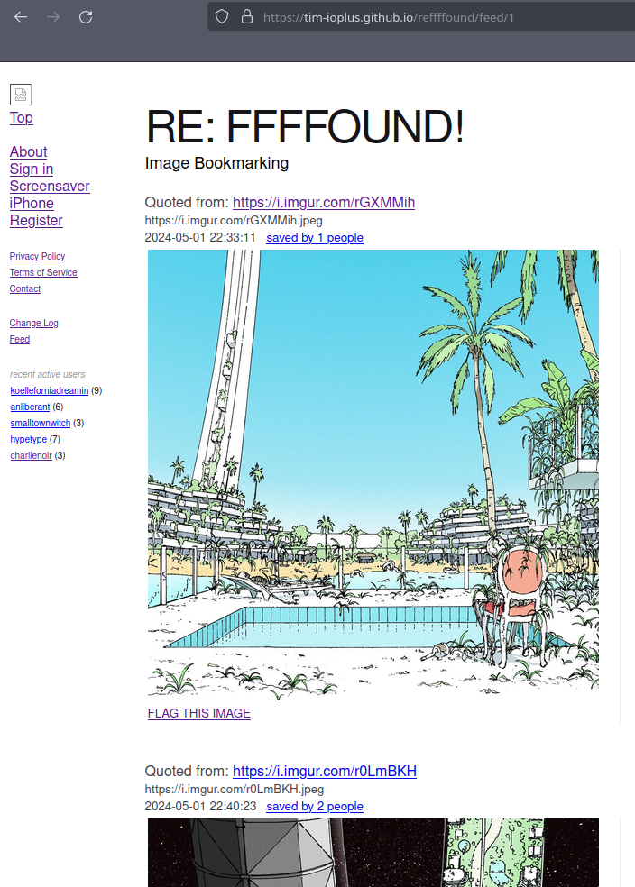

# REffffound

its ffffound - long lost, now refound :)

## Backlog items

### v .1 ok

* * view Feed:, mindestens 2 seitig (20stück), keine kontextbilder(!) [x]
	* * link 'saved by' user auf /bookmarks/guid [x]
* * View Detail: einzelbild, keine kontextbilder (rechts), keine kontextuser > [x]
* * View: Aktive Nutzer,  hardkodierten [x]
* * Feeddaten, Userdaten hardkodiert [x]
* * Userfeeds [x]
* * RE:ffffound logo [x]

### v .2 ==ok==

* Testhosting, ng version
 

### v .25
* * Unitttests für Models (zB. Timestamp parsing) > Y/2: mit TestController [x]  
* * CRUDLIST fähig für Posts > 3/4 >> Update/Put NOK issue '#6/#?/#9'> Y [x] 
* * Feeddaten, userdaten hardkodiert > Y [x] 
* * Guid bei post erzeugt #8 > Y [x] 

### v .30 ==ok==
* * angular version: use observables > Y [x] 

### v .xy ng Version nok
* * Frontend an Api angebunden > Y [x] 
	* * https://www.npmjs.com/package/ts-sync-request [x] 
	* * https://stackoverflow.com/questions/62296092/how-to-make-synchronous-http-request-in-angular-8-or-9-make-a-request-and-wait [x] 
* * Daten aus Api hardkodiert [x] 
* * CORS Fehler korrigiert > N [x]  
*  api gehostet

### v .3 ==ok==
* * Api an DB (Mongo? > SQL) angebunden [x] 
* * Daten read an FE [x] 

### v .4 ==ok==
* * Daten write aus Front End: Posts [x] 
* * Index Feed inkl Kontextbilder [x] 
* * Create Bookmark mit username via ViewBags [x] 
* * incl header logo bmp [x] 
* * fix css [x] 
  * * a:color [x] 
  * * font-type > serifiger [x] 
  * * link zu Flag Image more subtle [x] 
  * * fix blockquote position [x] 
  * * fix container position to left [x] 
* * text: fix title [x] 
* * Bookmark-element im feed: add 'Quoted from', link to url [x] 
* * Fix timestamp bug where current minutes saved as month [x] 
* * Hydrate() -> testdaten Create().. [x] 
* * Hydrate() [x] 
  * * generate timestamp from wihtin last 3 months and overwrite timestamps [x] 

 
### v .5

* * connection string & credentials in appsettings.json [x] 
* * feed navigation: previous- & next- buttons without 'full-pagination' [x] 
 * * include 'Last Post' logic to mark the end of feed [x] 
 * * add variety to Last Post to create a funny moment and communicate my crafty intentions [x]  
* * update end-of-feed View as own errror view. incl links to prev/next feed pages [x] 
* * css: difference in blockquote position index & list [x] 
* * css: fix txt position for current pagenum in pagination [x] 
* * all Database - queries mit .AddParameterWithValue > kein stringgebaue [x] 
* * Fix Bug in 'Update()' Method where bookmark.Title is being overwritten with Value from bookmark.Guid* [x] 
 
### v .6-0.7

* * add partial pages for Context menu, Legal menu [x] 
* * fix sql command string bug in List statement [x] 
* * Add Views and Functionality [x] 
  * * Edit bookmark [x] 
  * * Delete Bookmark [x] 
  * * Create Bookmark and Validate Input in Data Model class [x] 
* * remove unused Backup View 'OldList' [x] 
* * fix paging with negative number for Index, List, 404 [x] 
* * static float menu [x] 
  * * feed (index) for all: tile(v) [non actionable], top(t), previous(p), next (n) [x] 
  * * list (list) for user: create (c), tile(v), top(t), previous(p), next (n) [x] 
  * * detail: edit (e), delete (d) [x] 
  * * for Detail View: add dynamic menu item 'Back to list' linking to indexfeed or to userlist [x] 
* * adminpage: all from List page plus hydrate(h) [x] 
* * fix broken link: 404 page to feed [x] 
* * dont display guid on edit/delete pages [x]  
* * Use stronger Action text on Edit/Delete inputs for better Clarity of Actions [x] 

### v .8 ==ok==
* * block links
  * * register: ".. is invitation based service. If you like to receive an invitation you can contact us" [x]
  * * login: ".. if you have received an invite, please use the direct link provided." [x]
* * css cleanup for menu items [x]
* * for Release/Production Environment or without login hide the following Functions: Create, Edit, Delete, Hydrate [x] 
* * Add validation Message in Create- and Edit-View for invalid inputs [x]
* * Create and use Helper Service für User/Identity Tasks [x]

### v 0.9 - 0.91

*  * fix style for pagination links, style for 'First' link dynamic [x] 
*  * on 404 page move 'Back to List/feed' Link to bottom in pagination area [x] 
*  * move app hosting to azure [x]
*  * move database hosting to azure [x] 
*  * fix sql parameter bug in Statement to Select Contextual Bookmarks [x]
*  * add temporary aws downtime Message [x]
*  * remove version log [x]

### v 0.92

*  * dynamic filling of partial View for User Activity [x]
   
### v 1.0

* * encode email adress on pages: contact, flag content [x]
* * update content Imprint, Terms of Service [x]
* * fix layout on About page [x]
* * show cookie Banner [x]
* * remove aws Downtime Message [x]

### v 1.xy

* add new roles, users for app access to azure 
* for partial views..
  * fill dbo.ContentUsers with alphausers
  * on Bookmarks/Create increase Count property for posting Users by 
* in 'Bookmarks/Create' fill Title Field automaticlly > UrlField.onChange() request 
* Load spinner for images
* View Detail inkl Kontextbilder
 * 10 posts (5x2)
* View Detail inkl Kontextuser
 * die letzten 5 (5x1) Posts
* dynamische pagination: in indexfeed, in userfeed

## v x.y
* On users feed page list in sidebar
  * pageusers favourite Top10 users > users who pageuser favourited the most
  * pageusers 10 most recent followers (first establish basic pub>sub model)
* self hosting Images > azure blobs? 
* User Auth
  * sicherung > simpler api key oder jwt?
	* apikey: festerkeyhardcorediert wird bei jedem req in die payload gelgt und im controller abgefragt
	* jwt mit .net core:
	* https://learn.microsoft.com/de-de/aspnet/core/security/authentication/identity-api-authorization?view=aspnetcore-8.0
* Save bookmark for logged in users
* 'save' functionality for bookmarks of other Users

